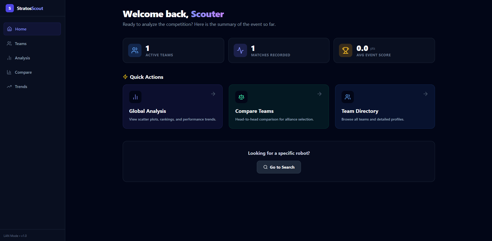

🚀 StratosScout Analysis Platform
StratosScout es una aplicación web progresiva (PWA) de alto rendimiento diseñada para el análisis de datos de Scouting en competencias de FRC (FIRST Robotics Competition).

Esta aplicación utiliza una Arquitectura Híbrida Offline-First: Combina la accesibilidad de una web moderna (alojada en Vercel) con la potencia de una red local para sincronización de datos en tiempo real sin depender del internet del estadio.

✨ Características Principales
📊 Análisis Avanzado: Gráficas de tendencias, consistencia en Auto/Teleop y métricas de rendimiento (EPA, promedios).

🆚 Comparador de Equipos: Herramienta "Head-to-Head" para visualizar fortalezas y debilidades entre alianzas.

📡 Sincronización Local (LAN): Recibe datos de múltiples scouters simultáneamente a través de un servidor puente en Python.

💾 Persistencia Offline: Los datos se guardan automáticamente en el navegador (localStorage), evitando pérdidas si se cierra la pestaña.

📱 Diseño Responsivo: Funciona en laptops, tablets y móviles.

📥 Importación Flexible: Soporta carga de CSV manual y escaneo de códigos QR.

🛠️ Arquitectura del Sistema
El sistema funciona conectando dispositivos móviles a una computadora central mediante una red local (Router o Hotspot).

Fragmento de código
graph TD
    A[Scouter 1 (Tablet)] -->|POST /api/scout/upload| C{Bridge Server (.exe)}
    B[Scouter 2 (Celular)] -->|POST /api/scout/upload| C
    C -->|Guarda| D[(local_scouting_data.csv)]
    E[Analysis App (Vercel)] -->|GET /api/csv| C
    E -->|Persistencia| F[Navegador LocalStorage]
Scout App: Envía datos a la IP de la computadora central.

Bridge Server: Un ejecutable Python que recibe los datos y actualiza el CSV local.

Analysis App: Lee el CSV desde localhost y visualiza las estadísticas.

🚀 Instalación y Configuración (Desarrollo)
Prerrequisitos
Node.js (v18+)

Python 3.9+ (Para el servidor local)

1. Clonar el repositorio
Bash
git clone https://github.com/tu-usuario/stratos-scout.git
cd stratos-scout
2. Frontend (React + Vite)
Bash
npm install
npm run dev
3. Servidor Local (Python Bridge)
Si deseas correr el script directamente:

Bash
pip install flask flask-cors pandas
python bridge.py
O ejecuta el archivo StratosServer.exe si ya lo compilaste.

🏆 Flujo de Trabajo en Competencia
Para usar el sistema en un evento regional sin internet:

Paso 1: Computadora Central (Lead Scouter)
Conectar la computadora a un Router Wi-Fi o crear un Hotspot.

Ejecutar StratosServer.exe.

Abrir la aplicación web (ej. tuscouting.vercel.app).

Ir a Settings > Conexión Central e ingresar localhost.

Dar clic en Conectar.

Paso 2: Scouters (Tablets/Celulares)
Conectarse a la red Wi-Fi de la computadora central.

Abrir la App de Scout.

Configurar el Endpoint URL con la IP de la computadora central: http://192.168.X.X:8000/api/scout/upload

¡Empezar a escanear!

📦 Generar Ejecutable del Servidor
Si necesitas regenerar el .exe del servidor puente:

Bash
pip install pyinstaller
pyinstaller --onefile --name "StratosServer" bridge.py
El archivo resultante estará en la carpeta dist/.

💻 Tecnologías Utilizadas
Frontend: React, TypeScript, Vite, Tailwind CSS.

Visualización: Recharts, Lucide React.

Backend Local: Python, Flask, Pandas.

Gestión de Datos: PapaParse, LocalStorage API, React Query.

📄 Estructura de Datos (CSV Schema)
El sistema espera un CSV con las siguientes columnas principales: timestamp, team_num, match_num, match_type, auto_pts, tele_pts, adv_role, adv_chasis, etc.

Desarrollado por Katheryn Azano. ¡Nos vemos en la competencia! 🤖